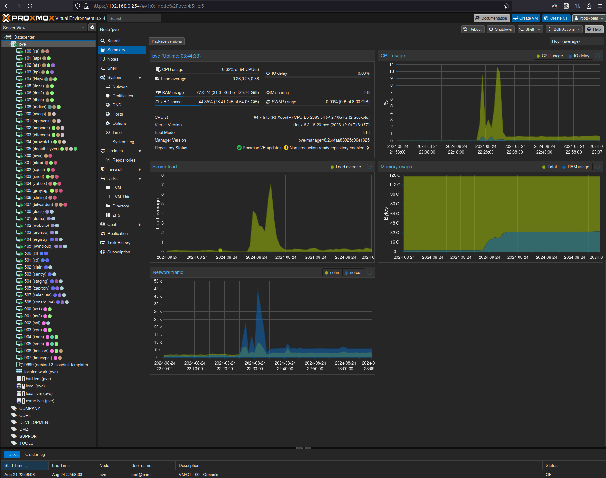

# Secure Self-Hosted Infrastructure for Small Business

This repository provides a comprehensive guide and resources for setting up a secure, self-hosted IT infrastructure tailored for small businesses. It includes detailed instructions, configurations, and best practices to help small businesses achieve a robust and secure environment without relying on third-party hosting services.

#### Key Features

- **Initial Setup Guide**: Step-by-step instructions for setting up servers and essential services.
- **Network Security**: Firewall configurations, VPN setup, and other security measures.
- **Identity and Access Management**: Setup for authentication and authorization services.
- **Self-Hosted Services**: Configuration for web servers, email servers, and more core services.
- **Monitoring and Logging**: Tools for infrastructure monitoring and log management.
- **Automation Scripts**: Scripts to automate maintenance and configuration tasks.

#### Benefits

- **Complete Control**: Full control over your data and infrastructure.
- **Enhanced Security**: Implement best practices for a secure infrastructure.
- **Cost-Effective**: Reduce costs by self-hosting essential services.
- **Flexibility**: Customize the infrastructure to meet your specific needs.

> [!IMPORTANT]
>
> This repository is created **solely for educational purposes**. The content provided here is intended to serve as examples and study material. **There are no guarantees that the code or any other material is suitable or safe for production use**.
>
> If you choose to use any part of this project in a production environment, **you do so at your own risk**. It is strongly recommended to thoroughly review the code and implement proper testing before any production use.

## Getting Started

To get started with this project, please refer to the [Wiki](https://github.com/MuriloChianfa/self-hosted-secure-infra/wiki) for a detailed step-by-step tutorial. The wiki contains comprehensive instructions and guidelines to help you set up and use the project effectively.

If you have any questions or run into issues, the wiki is a great place to start for troubleshooting and additional information.

---

## License

This project is licensed under the MIT License, see the [LICENSE](LICENSE.md) file for details.

## Acknowledgments

Special thanks to <a href="https://github.com/telmate/terraform-provider-proxmox">telmate/terraform</a> for providing a powerful Terraform provider for Proxmox.
